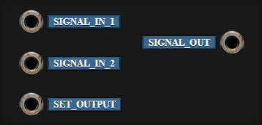
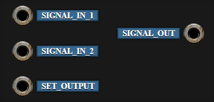
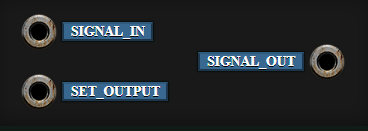
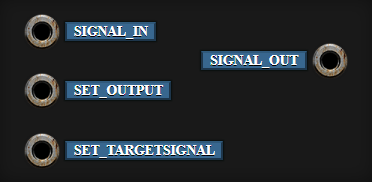

# Barotrauma Wiring Components

A brief guide to wiring components in Barotrauma, their inputs and outputs, and a few example circuits.

---

## Logic

### NOT

Inverts a signal.

#### INPUTS:

| SIGNAL_IN | Input signal |

#### OUTPUTS:

| SIGNAL_OUT | Inverted SIGNAL_IN |

---

### AND

Performs a logical AND on both of its inputs and outputs only if both inputs are receiving a signal.

#### INPUTS:

| SIGNAL_IN_1 | Input of first signal |
| SIGNAL_IN_2 | Input of second signal |
| SET_OUTPUT | Signal to output when true |

#### OUTPUTS:

| SIGNAL_OUT | Output signal |

---

### OR

Checks if either input is receiving signal and outputs only if true.

#### INPUTS:

| SIGNAL_IN_1 | Input of first signal |
| SIGNAL_IN_2 | Input of second signal |
| SET_OUTPUT | Signal to output when true |

#### OUTPUTS:

| SIGNAL_OUT | Output signal |

---

### XOR

Checks if *only one* input is receiving a signal and outputs only if true.

#### INPUTS:

| SIGNAL_IN_1 | Input of first signal |
| SIGNAL_IN_2 | Input of second signal |
| SET_OUTPUT | Signal to output when true |

#### OUTPUTS:

| SIGNAL_OUT | Output signal |

---

### Equals

Checks if both inputs are the same and outputs only if true.

#### INPUTS:

| SIGNAL_IN_1 | Input of first signal |
| SIGNAL_IN_2 | Input of second signal |
| SET_OUTPUT | Signal to output when equal |

#### OUTPUTS:

| SIGNAL_OUT | Output signal |

---

### Greater

Check if the first input is higher than the other and outputs only if true.

#### INPUTS:

| SIGNAL_IN_1 | Input of first signal |
| SIGNAL_IN_2 | Input of second signal |
| SET_OUTPUT | Signal to output when 1 > 2 |

#### OUTPUTS:

| SIGNAL_OUT | Output signal |

---

### RegEx Find

Checks if a signal in matches a regular expression string and outputs only if true. Commonly used with a Terminal.

[Regular Expression tool](https://regexr.com/)

#### INPUTS:

| SIGNAL_IN | Input signal to test against |
| SET_OUTPUT | Signal to output when true |

#### OUTPUTS:

| SIGNAL_OUT | Output signal |

---

### Signal Check

Checks if a signal in matches a target signal and outputs either a true / false output signal. True output signal can be set via SET_OUTPUT. Typically used to switch between a normal and "override" state.

#### INPUTS:

| SIGNAL_IN | Input signal to test with SET_TARGETSIGNAL |
| SET_OUPUT | Signal to output when true |
| SET_TARGETSIGNAL | Target signal to test SIGNAL_IN against |

#### OUTPUTS:
| SIGNAL_OUT | False output when signals don't match. True output when signals match. |

---
